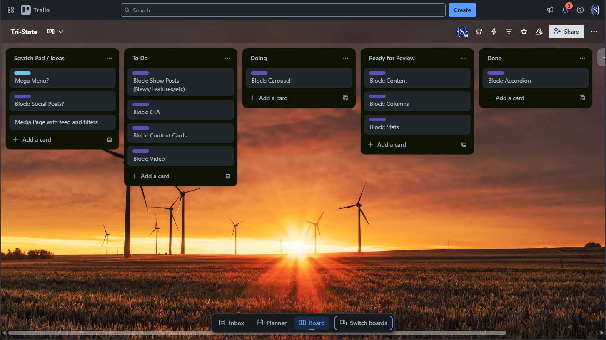
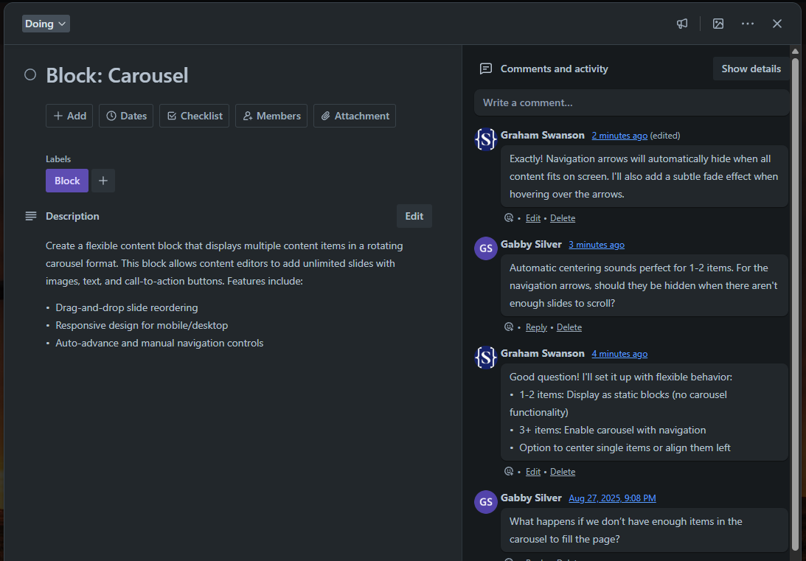
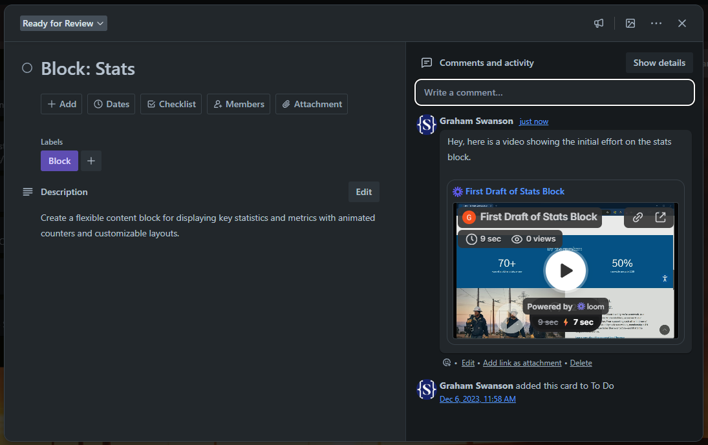

# Development Process

## Transparent Project Management with Trello

We use Trello boards to organize the Tri-State website development with a clean, modern approach that keeps everyone informed and communication streamlined throughout the project. This visual project management system makes it easy to stay updated on progress and participate in the development process.

### Development Workflow Stages

Your project board can be organized in a way that works best for your team and project needs. This workflow is flexible and can be customized for the specific requirements of the Tri-State project. Here's an example of how the board might be structured:

-   **Scratch Pad** - Initial ideas, notes, and features being planned or clarified
-   **To-Do** - Features ready to be developed with clear requirements
-   **Doing** - Features currently being actively worked on
-   **Ready for Review** - Completed work waiting for your feedback and approval
-   **Done** - Approved features completed and ready for launch

### Individual Feature Cards

Each feature or development task gets its own Trello card with:

-   **Clear description** of what's being built
-   **File attachments** for designs, screenshots, or documents
-   **Threaded comments** for all project communication
-   **Time stamps** showing progress and decision history

### Centralized Communication

Instead of scattered emails, all project communication happens in context:

-   **Single-topic discussions** - Each card focuses on one specific feature
-   **Team visibility** - Everyone can see relevant conversations
-   **Selective notifications** - Team members can watch specific cards or columns based on their role and interest
-   **File organization** - Screenshots and documents attached directly to relevant features
-   **No lost emails** - Everything stays organized in one place

### Client Benefits

**See Your Feedback Queue at a Glance** All items waiting for your input are clearly visible in the "Ready for Review" column. No more wondering what you need to respond to.

**Track Progress in Real Time** Watch features move from conception to completion. You'll always know where things stand without having to ask.

**Provide Context-Rich Feedback** Comment directly on the specific feature you're discussing, with the ability to attach screenshots or reference documents.

## Enhanced Communication with Loom

For complex features or when visual explanation is needed, we use Loom screen recordings to provide clear, detailed communication.

### When We Use Loom

-   **Feature demonstrations** - Show you exactly how new functionality works
-   **Feedback requests** - Walk through what we've built and ask specific questions
-   **Problem explanation** - Visual explanation of technical issues or constraints
-   **Design reviews** - Guide you through design decisions and options
-   **Training content** - Show you how to use new admin features

### Loom Benefits

**Quick to Create** Instead of writing long explanations, we can record a 2-minute screen capture that shows exactly what we mean.

**Easy to Consume** You can watch when you have time rather than coordinating schedules for lengthy meetings. Watch at your own pace, pause to take notes, or re-watch sections as needed.

**Reduces Miscommunication** Visual demonstration eliminates ambiguity about what we're discussing.

## Development Workflow Integration

### Feature Development Cycle

1. **Feature Planning** - Requirements discussed and clarified in Trello card comments
2. **Development** - Card moves to "Doing" with regular updates
3. **Internal Testing** - We verify functionality works as expected
4. **Client Review** - Card moves to "Ready for Review" column, often with Loom demo
5. **Feedback Integration** - Your comments guide any needed revisions
6. **Completion** - Approved features move to "Done" column

### Continuous Visibility

You'll have 24/7 access to:

-   Current project status
-   What's being worked on right now
-   What needs your attention
-   Complete project history and decisions
-   All project files and communications

### Team Collaboration

If multiple people from Tri-State need to be involved:

-   Everyone can be added to relevant cards
-   Notifications ensure the right people see updates
-   Different team members can handle different types of feedback
-   All context is preserved for everyone to see

---

_This transparent, organized approach ensures that the Tri-State website project runs smoothly with clear communication and no surprises. You'll always know what's happening and have easy ways to provide the feedback needed to keep things moving forward._
